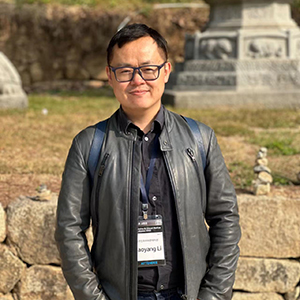
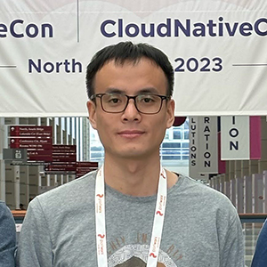

The OpenInfra Summit Asia and OCP Regional Summit APAC is a community-powered, not-for-profit event organized in collaboration with the [OpenInfra Foundation](https://openinfra.dev/) and the [Open Compute Project Foundation](https://www.opencompute.org/) to build the next decade of open source software and hardware! 

The Community-Powered OpenInfra Summit Asia | OCP Regional Summit APAC is being piloted by the OpenInfra and OCP Korea community organizers in collaboration with fellow organizers from various countries in Asia.

### Meet the OpenInfra Summit Asia Organizers

<table>
  <tr><td>

   Rico Lin</td>
  <td name="Seongsoo Cho">

   Seongsoo Cho</td>
  <td name="Sapturo Aryulianto">

   Sapturo Aryulianto</td>
</tr>
</table>

### Meet the Programming Committee

<table>
  <tr>
  <td name="Horace Li">

  </td>
  <td name="Lifu">

  </td><td>

  </td>
  <td name="Seongsoo Cho">

  </td>
  <td name="Sapturo Aryulianto">

  </td>
  <td name="Tovin - Nguyen Trong Vinh">

  </td>
  <td name="Qihui Zhao">

  </td>
  <td name="Wenhai Li">

  </td>
</tr>
</table>