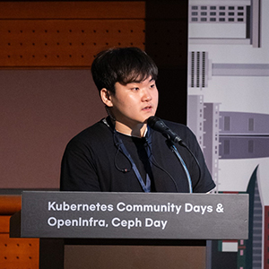
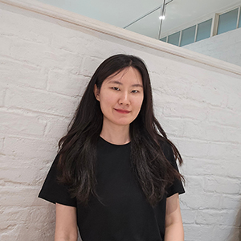
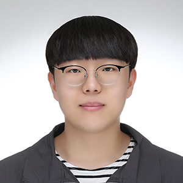
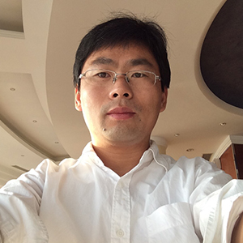
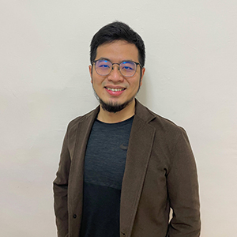
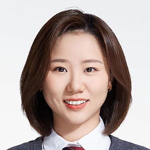
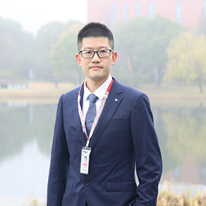

The OpenInfra Summit Asia and OCP Regional Summit APAC is a community-powered, not-for-profit event organized in collaboration with the [OpenInfra Foundation](https://openinfra.dev/) and the [Open Compute Project Foundation](https://www.opencompute.org/) to build the next decade of open source software and hardware!

The Community-Powered OpenInfra Summit Asia | OCP Regional Summit APAC is being piloted by the OpenInfra and OCP Korea community organizers in collaboration with fellow organizers from various countries in Asia.

## Meet the OpenInfra Summit Asia Organizers

<Grid>
  Aryulianto Saputro

 Hocheol Shin

 Horace Li

 Hosu Lee
</Grid>

<Grid>
 

 

 

</Grid>

<Grid>

</Grid>

## Meet the Programming Committee

<Grid>

 
 

 

</Grid>

<Grid>
 

 

 

</Grid>

<Grid>
 

 

</Grid>
